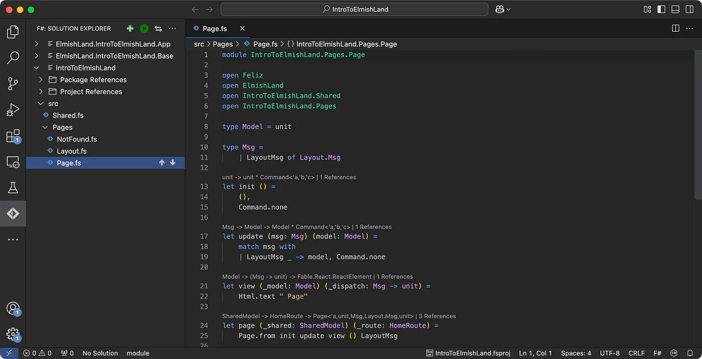

Elmish Land is a framework for F# designed to help you easily build scalable frontend web applications,
drawing heavy inspiration from [Elm Land](https://elm.land/). It simplifies many of the manual steps
usually present when developing with F#, [Fable](https://fable.io/) and [Elmish](https://zaid-ajaj.github.io/the-elmish-book/).

<!-- truncate -->

## Pages as Building Blocks

In Elmish Land, pages are the fundamental components of your application. The framework uses a file-system-based router where
folders in the `src/Pages` directory correspond to URL routes. For instance, creating a folder `src/Pages/About` with a `Page.fs` file
maps to the `/about` URL. This structure simplifies routing and enhances code organization.

## Type-Safe Routing

Elmish Land supports type-safe route and query parameters through the use of a `route.json` file.
This approach ensures that route parameters are correctly typed and parsed, reducing runtime errors and improving code reliability.

## Shared State Management

The framework allows for a SharedModel that stores data accessible across all pages. This shared state facilitates consistent
data management and simplifies the process of passing information between different parts of the application.

## Layouts and Commands

Elmish Land provides mechanisms for defining layouts and handling commands, enabling developers to structure their applications
effectively and manage side effects in a predictable manner.
By leveraging these features, Elmish Land aims to streamline the development of frontend web applications, making the process
more intuitive and the resulting applications more robust.