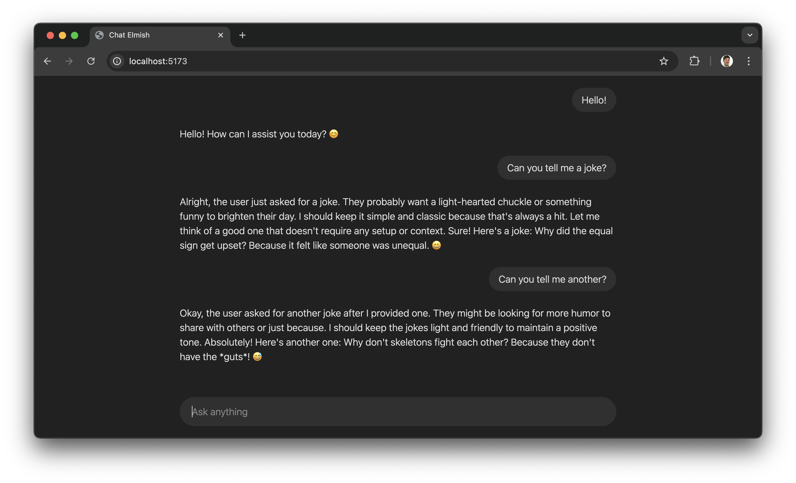

import Details from '@theme/MDXComponents/Details';

With the rise of AI chat applications, developers often rely on cloud-based APIs for natural language processing. However, running an AI model locally offers several advantages, including privacy, low latency, and cost savings. In this tutorial, we’ll build a local AI chat application using [F#](https://fsharp.org), [Elmish Land](https://elmish.land) and [Ollama](https://ollama.com) with the [DeepSeek-R1 model](https://ollama.com/library/deepseek-r1). The UI will be styled with [TailwindCSS](https://tailwindcss.com) to ensure a clean and modern look.

By the end of this guide, you’ll have a fully functional chat interface where you can interact with a locally hosted AI model.



<!-- truncate -->

## What is Ollama?

Ollama is an open-source framework for running large language models on your own computer. It provides an easy-to-use REST API to interact with models, making it ideal for applications that need an offline AI assistant.

Key features of Ollama:
* Runs AI models directly on your machine.
* Provides a lightweight REST API for chat interactions.
* Supports multiple models, including open-source LLMs.

To install Ollama, follow the instructions on their [official website](https://ollama.com/download).

Once installed, you can add the DeepSeek-R1 model with:

```bash
ollama pull deepseek-r1
```

## The DeepSeek-R1 Model

DeepSeek-R1 is an open-source AI model optimized for reasoning and chat interactions. It supports multi-turn dialogue and is efficient for running locally on consumer hardware.

Some highlights of Deepseek R1:
* Trained for chat-based applications.
* Optimized for low-resource environments.
* Provides coherent and context-aware responses.

We’ll use DeepSeek-R1 as our AI engine for this chat application.

## Project Setup

#### 1. Install Elmish Land
    ```bash
    mkdir ChatElmish
    cd ChatElmish
    dotnet tool install elmish-land --create-manifest-if-needed
    dotnet elmish-land init
    ```

#### 2. Install Thoth.Json to decode and encode JSON and Fable.Fetch for API calls:

```bash
dotnet add package Thoth.Json
dotnet add package Fable.Fetch
```

#### 3. Install TailwindCSS

    3.1. Install Tailwind and the vite plugin

    ```bash
    npm install tailwindcss @tailwindcss/vite
    ```

    3.2. Add the @tailwindcss/vite plugin to your Vite configuration `vite.config.js`:

    ```javascript title="/vite.config.js"
    import { defineConfig } from 'vite'
    // highlight-start
    import tailwindcss from '@tailwindcss/vite'
    // highlight-end

    export default defineConfig({
        // highlight-start
        plugins: [
            tailwindcss(),
        ],
        // highlight-end
        build: {
            outDir: "dist"
        }
    })
    ```

    3.3. Create a file named `styles.css` in the root folder of your project and add an `@import` for Tailwind CSS.

    ```css title="/styles.css"
    @import "tailwindcss";
    ```

    Add a link to your `styles.css` in the `<head>` section of your `index.html`, change the `<title>` tag and add the `dark dark:bg-[#212121]` css classes to the `<body>` tag.

    ```html title="/index.html"
    <!DOCTYPE html>
    <html lang="en" >
        <head>
            <meta name="viewport" content="width=device-width, initial-scale=1.0">
            <meta http-equiv="X-UA-Compatible" content="IE=edge">
            <meta charset="UTF-8">
            // highlight-start
            <link href="/styles.css" rel="stylesheet">
            <title>Chat Elmish</title>
            // highlight-end
        </head>
        // highlight-start
        <body class="dark dark:bg-[#212121]">
        // highlight-end
            <div id="app"></div>
            <script type="module" src=".elmish-land/App/App.fs.js"></script>
        </body>
    </html>
    ```

## Building the Chat App

The main page file of our AI chat application handles the user interface, state management, and interaction with the Ollama backend. [Here's the full code of the page](https://gist.github.com/klofberg/6ad4094b8e131f8eef81630fdb7a5aeb) to be pasted in your `/src/Pages/Page.fs` file.


### The State of Our App

```fsharp
type Model = {
    History: (string * string) list
    Question: string
}
```

The `Model` type stores the user's current question and a history of all previous interactions. This history is used both for displaying in the UI and for sending to Ollama with each new query, ensuring that the AI retains context across multiple exchanges.

### Displaying the `Ask Anything` Input and Handling User Input

```fsharp
Html.input [
    prop.className "w-full outline-none resize-none border-0 bg-transparent p-2"
    prop.value model.Question
    // highlight-start
    prop.onChange (fun text -> dispatch (UpdateQuestion text))
    prop.onKeyUp (fun e ->
        if e.key = "Enter" then
            dispatch (AskQuestion dispatch)
    )
    // highlight-end
    prop.placeholder "Ask anything"
]
```

We need to update our `Model` whenever the user types a new question. The `onChange` event ensures that every keystroke updates the `Question` field in the model, while the `onKeyUp` event listens for the Enter key press to trigger the `AskQuestion` message.

### Updating State based on User Input

```fsharp
let update (msg: Msg) (model: Model) =
    match msg with
    ...
    // highlight-start
    | UpdateQuestion question ->
        { model with Question = question }, Command.none
    | AskQuestion dispatch ->
        let history = (model.Question, "") :: model.History
        { model with
            Question = ""
            History = history
        },
        Command.ofPromise
            askOllama
                (history, dispatch << ResponseReceived)
                ResponseCompleted
    // highlight-end
    ...
```

When the `UpdateQuestion` message is received, the model is updated with the latest user input. When the `AskQuestion` message is received, the new question is added to the `History`, and the input field is cleared. We then send the entire conversation history to Ollama, initiating a streaming response.

### Sending the Request to Ollama

#### 1. Encoding the JSON Request

We format the request body as required by the [Ollama API](https://github.com/ollama/ollama/blob/main/docs/api.md#generate-a-chat-completion), using the [Thoth.Json library](https://thoth-org.github.io/Thoth.Json/) for JSON encoding.

    ```fsharp
    let askOllama (history: (string * string) list, responseReceived) =
        let body =
            // highlight-start
            Encode.object [
                "model", Encode.string "deepseek-r1:latest"
                "messages", Encode.list [
                    for user, assistant in List.rev history do
                        Encode.object [
                            "role", Encode.string "user"
                            "content", Encode.string user
                        ]
                        if assistant <> "" then
                            Encode.object [
                                "role", Encode.string "assistant"
                                "content", Encode.string assistant
                            ]
                ]
            ]
            |> Encode.toString 2
            // highlight-end
        ...
    ```

#### 2. Making the API Call

We use the [Fable.Fetch](https://github.com/fable-compiler/fable-fetch) library to send the request to Ollama.

    ```fsharp
    let askOllama (history: (string * string) list, responseReceived) =
        ...
        // highlight-start
        fetch
            "http://localhost:11434/api/chat"
            [
                Method HttpMethod.POST
                Body (BodyInit.Case3 body)
            ]
        // highlight-end
        ...
    ```

#### 3. Handling Streaming Responses

The response is processed as a stream, allowing incremental updates to the UI.

    ```fsharp
    let askOllama (history: (string * string) list, responseReceived) =
        ...
            // highlight-start
            ResponseHelper.readStream response (fun chunk ->
                Encoding.UTF8.GetString chunk
                |> Decode.unsafeFromString decodeResponse
                |> responseReceived
            )
            // highlight-end
        ...
    ```

Since Fable.Fetch does not support the [Streams API](https://developer.mozilla.org/en-US/docs/Web/API/Streams_API/Using_readable_streams#consuming_a_fetch_using_asynchronous_iteration) yet, we use [JavaScript interop](https://fable.io/docs/javascript/features.html#emit-when-f-is-not-enough) to process the streamed response.

    ```fsharp
    module ResponseHelper =
        [<Emit("""
        async function readStream(response, chunkReceived) {
            for await (const chunk of response.body) {
                chunkReceived(chunk);
            }
        }
        """)>]
        let dummy: unit = jsNative
        dummy

        [<Global("readStream")>]
        let readStream
            (response: Response)
            (chunkReceived: byte[] -> unit)
            : JS.Promise<unit> = jsNative
    ```

### Processing Responses from Ollama

When a response chunk arrives, we update the last entry in the history with the received text. We do this by extracting the latest entry from our `History` and append the new response chunk to the answer.

```fsharp
let update (msg: Msg) (model: Model) =
    ...
    match msg with
    // highlight-start
    | ResponseReceived response ->
        let newHistory =
            match model.History with
            | [] -> []
            | (question, answer) :: tail ->
                (question, answer + response) :: tail
        { model with History = newHistory }
        , Command.none
    // highlight-end
    ...
```

### Rendering the Chat History

The chat history is displayed in the UI, ensuring messages appear in the correct order. The history list is in revered order so we need to add the class `flex-col-reverse` to display it correctly. The added benefit of this is that new text at the bottom will be automatically shown when it overflows and need scrolling.

```fsharp
let view (model: Model) (dispatch: Msg -> unit) =
    ...
    // highlight-start
    Html.div [
        prop.className "w-180 flex flex-col flex-col-reverse gap-6 overflow-y-auto pb-5"
        prop.children [
            for question, answer in model.History do
                Html.div [
                    prop.innerHtml answer
                ]
                Html.div [
                    prop.className "flex justify-end"
                    prop.children [
                        Html.div [
                            prop.className "rounded-3xl px-4 py-2 dark:bg-[#303030]"
                            prop.text question
                        ]
                    ]
                ]
        ]
    ]
    // highlight-end
    ...
```

### Running the Application

To start the chat application, simply run:

```bash
dotnet elmish-land server
```

💡 **Note**: Safari on macOS dosn't seem to work with the the [Streams API](https://developer.mozilla.org/en-US/docs/Web/API/Streams_API/Using_readable_streams#consuming_a_fetch_using_asynchronous_iteration).

## Wrap-Up

In this post, we built a simple AI-powered chat application using Elmish Land, Ollama, and DeepSeek. We covered key concepts such as managing state, handling user input, making API calls, and rendering the chat history. The use of streaming responses enhances the user experience by providing real-time updates.

This application allows for further improvements, such as adding error handling, refining the UI, or integrating additional AI models. By leveraging F# and Elmish, we ensure a functional and maintainable approach to frontend development.

Now that you have a working foundation, what features will you add next?