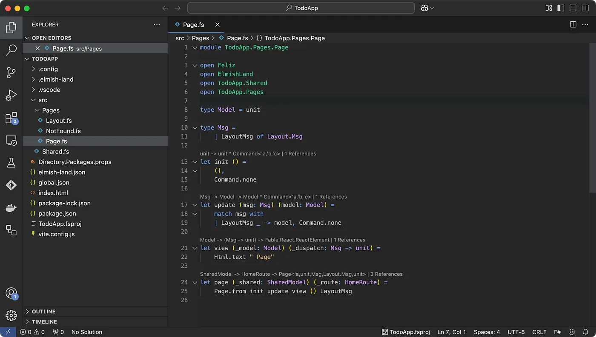

Creating web applications can be a daunting task, especially when managing state and ensuring a seamless user experience.
Elmish Land offers a declarative and functional approach to building modern web apps. In this post, we’ll walk through building
a simple to-do app using Elmish Land, step-by-step.

<!-- truncate -->

## Setting Up the Project

Before we dive into coding, ensure you have the following installed:

* [Node.js](https://nodejs.org/)
* [dotnet SDK](https://dotnet.microsoft.com/download)

To create a new project:

```bash
mkdir TodoApp
cd TodoApp
dotnet new tool-manifest
dotnet tool install elmish-land
dotnet elmish-land init
dotnet elmish-land server
```

This sets up a basic Elmish Land project with all the dependencies you need and starts the development server.



## Understanding the page structure

Open the newly created folder in your preferred editor (I use [Visual Studio](https://code.visualstudio.com/) Code with
the [Ionide](https://marketplace.visualstudio.com/items?itemName=Ionide.Ionide-fsharp) extension for F# support)
and open the file `src/Pages/Page.fs`. This is the default page of the app.

Elmish Land pages are structured around the MVU pattern:

1. **Model**: Represents the application’s state.
2. **Update**: Defines how the state changes in response to messages.
3. **View**: Specifies how the state is rendered as a user interface.

Here’s how we’ll use these concepts to build our to-do app.

## Step 1: Define the model

The model is the backbone of your application. For a to-do app, we’ll need to keep track of tasks and their completion status:

```fsharp
type Todo = { Text: string; Completed: bool }

// highlight-start
type Model = {
    Todos: Map<int, Todo>
    NewTodo: string option
}
// highlight-end

...

let init () =
    { Todos = Map.empty; NewTodo = None }, Command.none
```

The `Model` type is updated to with a list of to-dos and a field to allow adding a new to-dos.
The `init` function is updated to create an empty list of to-dos.

## Step 2: Handling updates

Next, define the messages and the update function. Messages represent actions users can take:

```fsharp
type Msg =
    | LayoutMsg of Layout.Msg
    | ChangeNewTodo of string
    | AddTodo
    | CompleteTodo of int

...

let update (msg: Msg) (model: Model) =
    match msg with
    | LayoutMsg _ -> model, Command.none
    | ChangeNewTodo newValue ->
        {
            model with
                NewTodo =
                    if String.IsNullOrWhiteSpace newValue then
                        None
                    else
                        Some newValue
        },
        Command.none
    | AddTodo ->
        match model.NewTodo with
        | Some newTodo ->
            {
                model with
                    NewTodo = None
                    Todos = Map.add (model.Todos.Count + 1) { Text = newTodo; Completed = false } model.Todos
            },
            Command.none
        | None -> model, Command.none
    | CompleteTodo todoId ->
        match Map.tryFind todoId model.Todos with
        | Some todo -> {
            model with
                Todos =
                    Map.add
                        todoId
                        {
                            todo with
                                Completed = not todo.Completed
                        }
                        model.Todos
          }
        | None -> model
        , Command.none
```

### ChangeNewTodo

This message is sent when the user types text in the input field. The model is updated with the new value
of the input field for every key stroke.

### AddTodo

By clicking the `Add todo` button we can add a new to-do. This handler checks that the `NewTodo` field of the
model has a value before adding it to the list of todos. The `NewTodo` field is then cleared.

### CompleteTodo

This message handles when the user checks a to-do. First we check that the ID of the to-do exists and
then we update the list of to-dos and toggles the Completed field of the model.

## Step 3: Building the view

The view function describes how to render the model’s state into HTML:

First we add a `form` with the submit functionality disabled:

```fsharp
prop.onSubmit (fun e -> e.preventDefault ())
```

We do this to enable pressing `Enter` to add a new to-do.

Then we add an input field and a button to add a new to-do. We use an unordered list with checkboxes to display our to-dos.

```fsharp
let view (model: Model) (dispatch: Msg -> unit) =
    Html.div [
        Html.form [
            prop.onSubmit (fun e -> e.preventDefault ())
            prop.children [
                Html.input [
                    prop.value (defaultArg model.NewTodo "")
                    prop.onChange (ChangeNewTodo >> dispatch)
                ]
                Html.input [
                    prop.type'.submit
                    prop.value "Add todo"
                    prop.disabled model.NewTodo.IsNone
                    prop.onClick (fun _ -> dispatch AddTodo)
                ]
            ]
        ]
        Html.ul [
            for KeyValue(todoId, todo) in model.Todos do
                Html.li [
                    prop.id todoId
                    prop.children [
                        Html.label [
                            prop.children [
                                Html.input [
                                    prop.type'.checkbox
                                    prop.isChecked todo.Completed
                                    prop.onCheckedChange (fun _ -> dispatch (CompleteTodo todoId))
                                ]
                                if todo.Completed then
                                    Html.s [ Html.text todo.Text ]
                                else
                                    Html.text todo.Text
                            ]
                        ]
                    ]
                ]
        ]
    ]
```

## Wrapping it up

Building a to-do app with Elmish Land showcases the power and simplicity of the MVU pattern.
By breaking the application into clear, manageable parts, you can focus on writing clean, maintainable code.
Whether you’re a seasoned F# developer or new to functional programming,
Elmish Land is a fantastic tool to add to your toolkit.

Below is the complete `Page.fs` file for the app.

Happy coding!

```fsharp
module TodoApp.Pages.Page

open System
open Feliz
open ElmishLand
open TodoApp.Shared
open TodoApp.Pages

type Todo = { Text: string; Completed: bool }

type Model = {
    Todos: Map<int, Todo>
    NewTodo: string option
}

type Msg =
    | LayoutMsg of Layout.Msg
    | ChangeNewTodo of string
    | AddTodo
    | CompleteTodo of int

let init () =
    { Todos = Map.empty; NewTodo = None }, Command.none

let update (msg: Msg) (model: Model) =
    match msg with
    | LayoutMsg _ -> model, Command.none
    | ChangeNewTodo newValue ->
        {
            model with
                NewTodo =
                    if String.IsNullOrWhiteSpace newValue then
                        None
                    else
                        Some newValue
        },
        Command.none
    | AddTodo ->
        match model.NewTodo with
        | Some newTodo ->
            {
                model with
                    NewTodo = None
                    Todos = Map.add (model.Todos.Count + 1) { Text = newTodo; Completed = false } model.Todos
            },
            Command.none
        | None -> model, Command.none
    | CompleteTodo todoId ->
        match Map.tryFind todoId model.Todos with
        | Some todo -> {
            model with
                Todos =
                    Map.add
                        todoId
                        {
                            todo with
                                Completed = not todo.Completed
                        }
                        model.Todos
          }
        | None -> model
        , Command.none

let view (model: Model) (dispatch: Msg -> unit) =
    Html.div [
        Html.form [
            prop.onSubmit (fun e -> e.preventDefault ())
            prop.children [
                Html.input [
                    prop.value (defaultArg model.NewTodo "")
                    prop.onChange (ChangeNewTodo >> dispatch)
                ]
                Html.input [
                    prop.type'.submit
                    prop.value "Add todo"
                    prop.disabled model.NewTodo.IsNone
                    prop.onClick (fun _ -> dispatch AddTodo)
                ]
            ]
        ]
        Html.ul [
            for KeyValue(todoId, todo) in model.Todos do
                Html.li [
                    prop.id todoId
                    prop.children [
                        Html.label [
                            prop.children [
                                Html.input [
                                    prop.type'.checkbox
                                    prop.isChecked todo.Completed
                                    prop.onCheckedChange (fun _ -> dispatch (CompleteTodo todoId))
                                ]
                                if todo.Completed then
                                    Html.s [ Html.text todo.Text ]
                                else
                                    Html.text todo.Text
                            ]
                        ]
                    ]
                ]
        ]
    ]

let page (_shared: SharedModel) (_route: HomeRoute) = Page.from init update view () LayoutMsg
```